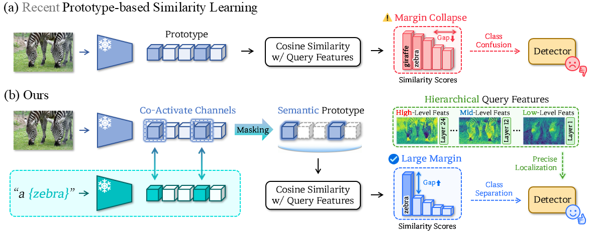

# Rethinking Prototype-based Similarity Learning for Few-Shot Object Detection

<p align="left">
  <a href="https://arxiv.org/abs/2606.23069">
    
  </a>
  <a href="https://visualsciencelab-khu.github.io/ReSet_project/">
    
  </a>
</p>

<p align="center">
  
</p>


<pre><b>TL;DR</b>: ReSet resolves class confusion and imprecise localization in prototype-based few-shot object detection by constructing text-anchored semantic prototypes and refining boxes with stage-aligned hierarchical ViT features.</pre>


## Environment

```bash
conda create -n ReSet python=3.9 
conda activate ReSet
pip install -r ReSet/requirements.txt
pip install -e ./ReSet
```


## Datasets

Datasets are stored inside the `datasets` folder of [DE-ViT](https://rutgers.app.box.com/s/2lco6ab66pn3ufq6rh4gmyfzg9vfkm23).

### Dataset Preparation

Set `DETECTRON2_DATASETS` to the Detectron2 dataset root before extracting the files.

Required datasets:

- COCO 2014 and COCO 2017 images and standard annotations
- Pascal VOC 2007 and 2012
- `datasets/coco/annotations/` for the provided few-shot and one-shot COCO annotations
- `datasets/cocosplit.tar.gz` for the COCO 2014 few-shot splits
- `datasets/vocsplit.zip` for the Pascal VOC few-shot splits

```bash
mv datasets/coco/annotations/* "$DETECTRON2_DATASETS/coco/annotations/"
tar xvf datasets/cocosplit.tar.gz -C "$DETECTRON2_DATASETS"
unzip datasets/vocsplit.zip -d "$DETECTRON2_DATASETS"
```

The retained COCO annotation assets include:

- `fs_coco14_base_train.json` and `fs_coco14_base_val.json`
- `coco_2017_train_oneshot_s1.json` through `coco_2017_train_oneshot_s4.json`
- `coco_2017_val_oneshot_s1.json` through `coco_2017_val_oneshot_s4.json`
- `coco_2017_novel_oneshot_s*_r50.json` and `coco_2017_novel_oneshot_s*_r100.json`


## Checkpoints

Checkpoints are stored inside the `weights` folder of [DE-ViT](https://rutgers.app.box.com/s/2lco6ab66pn3ufq6rh4gmyfzg9vfkm23). Keep these checkpoint groups under `weights/`:

- `initial/DINOv2/`: ViT-S/B/L backbone weights
- `initial/background/`: background prototypes
- `initial/few-shot/`: COCO few-shot prototypes and combined ViT/RPN weights
- `initial/oneshot/`: COCO one-shot prototypes and combined ViT/RPN weights
- `initial/few-shot-voc/`: Pascal VOC few-shot initialization, when available
- `initial/rpn/few-shot-coco14/` and `initial/rpn/one-shot-split*/`: retained RPN weights
- `trained/few-shot/`, `trained/one-shot/`, and `trained/few-shot-voc/`: trained checkpoints and logs

Pre-combined files such as `vitl+rpn.pth` can be used directly. To build a checkpoint manually, use `tools/combine_vit_rpn_weights.py`.

If you want to train the weights yourself instead of downloading pre-trained ones:

### Build Prototypes

```bash
# Generate instance prototypes for base category of FSOD COCO
python3 ./tools/extract_instance_prototypes.py --dataset fs_coco14_base_train --model vits14
# will produce a file `fs_coco14_base_train.vits14.pkl`

# Generate instance prototypes for novel category of FSOD COCO
python3 ./tools/extract_instance_prototypes.py --dataset fs_coco_trainval_novel_30shot --model vits14 --epochs 60
# will produce a file `fs_coco_trainval_novel_30shot.vits14.pkl`

# Generate class prototypes through clustering
python3 ./tools/run_sinkhorn_cluster.py --inp ./fs_coco14_base_train.vits14.pkl --epochs 10 --momentum 0.002 --num_prototypes 10
# will produce a file `fs_coco14_base_train.vits14.p10.sk.pkl`

python3 ./tools/run_sinkhorn_cluster.py --inp ./fs_coco_trainval_novel_30shot.vits14.pkl --epochs 30 --momentum 0.002 --num_prototypes 10
# will produce a file `fs_coco_trainval_novel_30shot.vits14.p10.sk.pkl`
```

Then, set `DE.CLASS_PROTOTYPES` to `fs_coco14_base_train.vits14.p10.sk.pkl,fs_coco_trainval_novel_30shot.vits14.p10.sk.pkl` to use the above generated prototypes. The stuff classes of the `coco_2017_train_panoptic_stuffonly` dataset are used to extract background prototypes with the same procedure.

A list of base / novel dataset pairs:

- Few-Shot COCO 14: `fs_coco14_base_train / fs_coco_trainval_novel_10shot`
- One-Shot COCO split 1: `coco_2017_train_oneshot_s1 / coco_2017_novel_oneshot_s1_r50` (r50 means reservoir 50 samples, we randomly pick 50 samples for eval during training)


### RPN Training

```bash
bash scripts/train_rpn.sh  ARG
# change ARG to os1 / os2 / os3 / os4 / fs14
# corresponds to one-shot splits 1-4 / few-shot

bash scripts/train_rpn.voc.sh  ARG
# change ARG to 1, 2, 3 for split 1/2/3.
```


### Combine RPN Weights with ViT Weights

You need to combine ViT and RPN into a single checkpoint. All initial models with names like `vits+rpn.pth` are pre-combined. The tool used is [tools/combine_vit_rpn_weights.py](tools/combine_vit_rpn_weights.py).


### Semantic Mask

Download the semantic masks from [Drive](https://drive.google.com/drive/folders/14d5Jt3UHodZbm3BFvhSFt5Upyqjd6Abd?usp=sharing).


## Training

```bash
vit=l task=fsod dataset=coco shot=10 bash scripts/train.sh

# task=fsod / osod
# dataset=coco / voc
# vit=s / b / l 
# split = 1 / 2 / 3 / 4 for coco one shot, and 1 / 2 / 3 for voc few-shot. 

# few-shot env var `shot = 5 / 10 / 30`
vit=l task=fsod shot=10 bash scripts/train.sh 

# one-shot env var `split = 1 / 2 / 3 / 4`
vit=l task=osod split=1 bash scripts/train.sh

# detectron2 options can be provided through args, e.g.,
task=fsod dataset=coco shot=10 bash scripts/train.sh SOLVER.MAX_ITER 1000

# another env var is `num_gpus = 1 / 2 ...`, used to control
# how many gpus are used
```


## Evaluation

All evaluations can be run without training, as long as the checkpoints are downloaded.

The script-level environment variables are the same to training.

```bash
vit=l task=fsod dataset=coco shot=10 bash scripts/eval.sh

vit=l task=osod dataset=coco split=1 bash scripts/eval.sh

# evaluate Pascal VOC split-3 with ViT-L/14 with 5 shot
vit=l task=fsod dataset=voc split=3 shot=5 bash scripts/eval.sh 
```


## Citation

```
@misc{heo2026rethinkingprototypebasedsimilaritylearning,
      title={Rethinking Prototype-based Similarity Learning for Few-Shot Object Detection},
      author={KunHo Heo and Seungjae Kim and Wongyu Lee and SuYeon Kim and MyeongAh Cho},
      year={2026},
      eprint={2606.23069},
      archivePrefix={arXiv},
      primaryClass={cs.CV},
      url={https://arxiv.org/abs/2606.23069},
}
```


## Acknowledgement

We thank for: [DE-ViT](https://github.com/mlzxy/devit), [CD-ViTO](https://github.com/lovelyqian/CDFSOD-benchmark), [PiDiViT](https://github.com/Seaz9/PiDiViT), etc.